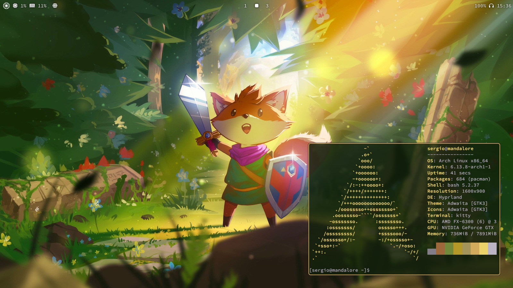
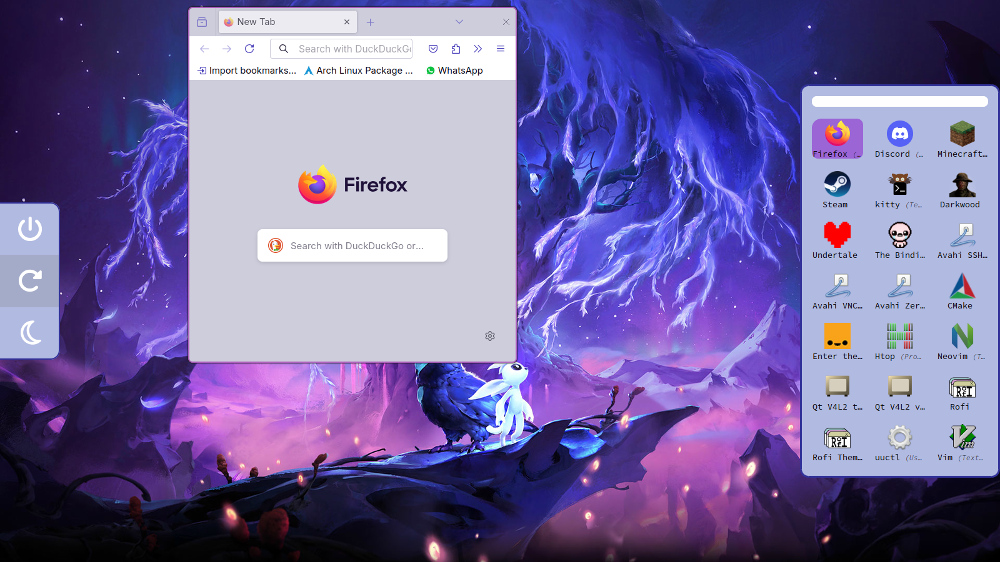

<h1>An auto-colored interface for Hyprland</h1>


From window borders and notifications to the terminal and the widgets, (mostly) everything is automatically changed to the color palette of your wallpaper, which you can easily change with the built-in wallpaper selector.


The hyprland binds and configs let you enjoy a beautiful design while still being centered on functionality and productivity.


<h4>Automatic installation included!</h4>
The installer lets you choose which features get installed and which don't (made with love for the people who think a powermenu widget is bloat).

To install them, do:
```
$ git clone https://github.com/sergoncano/hyprdots.git
$ cd hyprdots
$ chmod +x installer.sh; ./installer.sh
```
Run as sudo if needed, although I encourage you to read what the installer does before running it.

These dotfiles are my first and hence they are not perfect, but I'll be updating them constantly.
I'm open for suggestions and pull requests. 
